# Optimised design — `wing_v01`

Best of the **22 iterations** of run `iterations` (21 succeeded, 1 failed), selected on objective `maximize_Cl_Cd`.

> **Translated by hand.** `scripts/export_best.py` writes its reports in English, and the [Clark Y report](../example_report_clarky/README.md) was produced by it directly. This one is older: it dates from v1.0, its raw iteration data has since been purged from the repository, and it therefore cannot be regenerated. It was translated by hand instead. The numbers, figures and tables are untouched.

## Performance

| | Cd | Cl | Cl/Cd |
|---|---|---|---|
| Start (iteration 0) | 0.03107 | 0.25266 | 8.13 |
| **Optimised (iteration 21)** | **0.02563** | **0.76572** | **29.88** |
| *— measured in exploration* | *0.04037* | *0.82534* | *20.45* |

**Lift-to-drag gain: +151.5 %** — between the two **exploration** measurements: the starting row and the one in italics. At the fine settings, the constant-regime comparison is given further down, under “Before / after”; it is lower, because a coarse mesh exaggerates differences.

Mesh: 168,394 cells, non-orthogonality 47.4, skewness 2.10. Coefficients averaged over 200 iterations, relative standard deviation 3.7e-05 on Cd — stabilised.

## Parameters: start → finish

| parameter | start | finish | change | bounds |
|---|---|---|---|---|
| `chord` | 300 | **343.47** mm | +14.5 % | 220 … 420 |
| `thickness` | 0.12 | **0.113351** unitless | -5.5 % | 0.08 … 0.2 |
| `camber` | 0.02 | **0.02** unitless | unchanged | 0 … 0.09 |
| `span` | 80 | **80** mm | unchanged | 79 … 81 |
| `aoa` | 0 | **5.04** deg | +5.04 | -2 … 12 |

## Before / after

The starting seed against the retained design, both measured **in the same CFD regime** (fine settings) — comparing a fine mesh against an exploration mesh would inflate the gain without it being real.

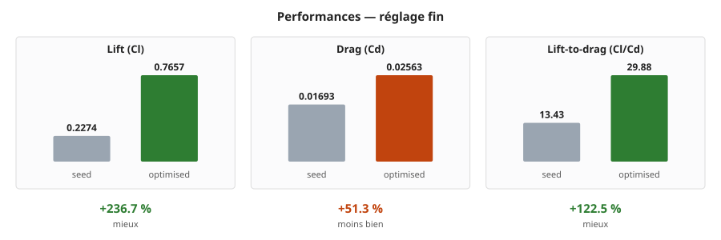

| | seed | optimised | change |
|---|---|---|---|
| **Lift Cl** | 0.2274 | **0.7657** | +236.7 % ✓ |
| **Drag Cd** | 0.01693 | **0.02563** | +51.3 % ✗ |
| **Lift-to-drag Cl/Cd** | 13.43 | **29.88** | +122.5 % ✓ |

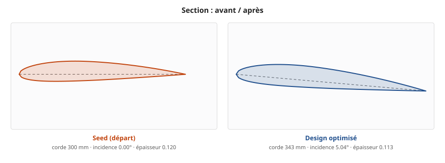

Both sections are drawn at the **same scale**: each fitted to its own frame, they would look identical, and both the chord difference and the incidence would go unnoticed.

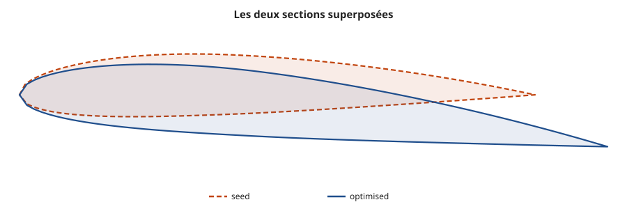

### Pressure, before and after

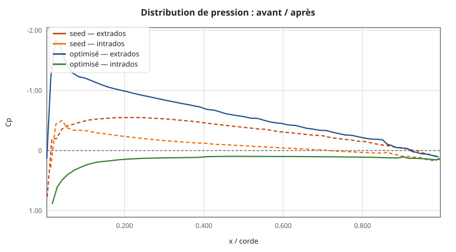

The area between the upper-surface curve and the lower-surface curve *is* the lift. The optimised design deepens its upper-surface suction and spreads it along the chord: that is where the extra lift is won.

### The fields, side by side

<!-- side-by-side -->

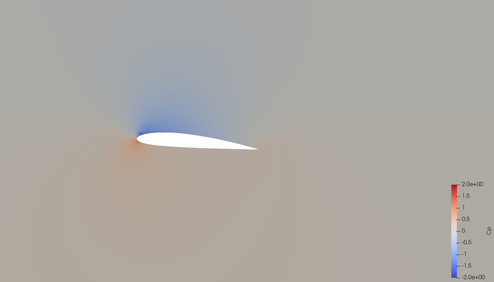
<!-- /side-by-side -->

<!-- side-by-side -->

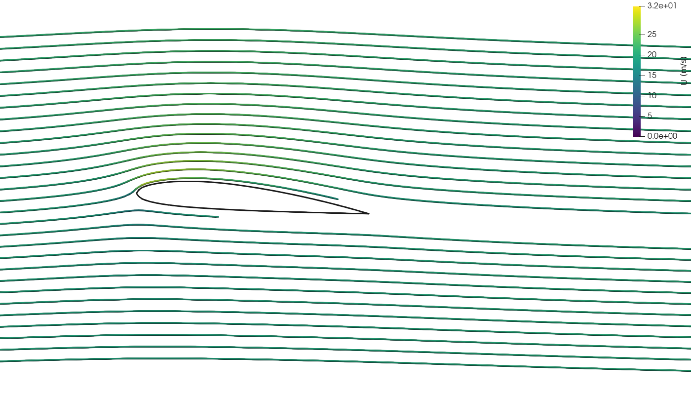
<!-- /side-by-side -->

Same colour scale on both sides — that is the condition for the comparison to mean anything. The upper-surface suction, in blue, is markedly stronger and more extensive after optimisation.

## Why this shape is better

- **Incidence raised by 5.04°** (0.00° → 5.04°). This is the most direct lever on lift: tilting the profile deflects more flow downwards, and the reaction to that deflection *is* the lift. Induced drag grows roughly as the square of lift, so lift-to-drag passes through a maximum — typically between 4° and 6° for a cambered profile — then collapses at stall. The value retained, 5.04°, falls in that range: the search found the top of the curve.
- **Profile thinned** (0.1200 → 0.1134 relative thickness). A thinner profile disturbs the flow less and drags less. The counterpart is structural — less inertia, so less stiffness — and a more abrupt stall, since a sharper leading edge copes badly with high incidence.
- **Chord raised to 343.5 mm** (from 300.0). It acts in two ways: the Reynolds number rises, which slightly lowers the friction coefficient, and the reference area changes — it is recomputed at every iteration, without which comparing the coefficients would mean nothing.
- **The trade-off in numbers**: lift gains +237 % for only +51 % of drag. That is exactly what a lift-to-drag optimisation seeks — not to drag less, but to lift a great deal more for a modest drag penalty.
- **What the pressure distribution shows**: the suction peak reaches Cp = -1.83 at 3 % of chord. The upper surface does the work — the suction there pulls the profile upwards, and it weighs far more than the lower-surface overpressure. A very deep peak followed by an abrupt recovery would signal separation; a gradual recovery, as here, indicates flow that is still attached.

## Course of the optimisation

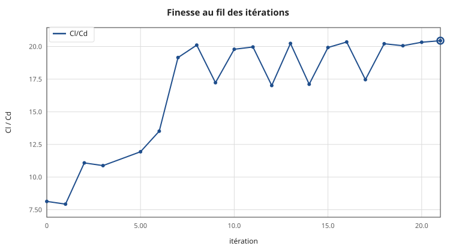

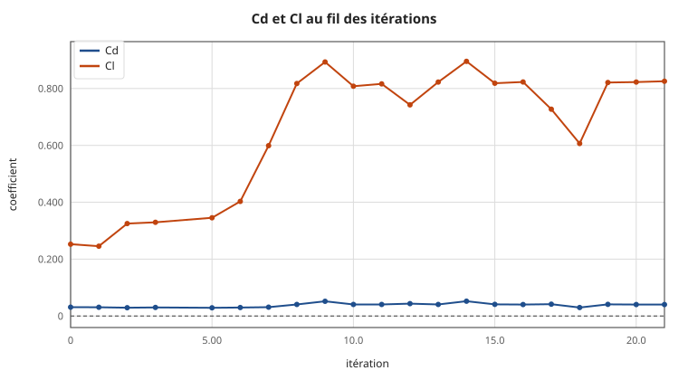

| iteration | Cd | Cl | Cl/Cd | status |
|---|---|---|---|---|
| 0 | 0.03107 | 0.25266 | 8.13 | OK |
| 1 | 0.03097 | 0.24549 | 7.93 | OK |
| 2 | 0.02934 | 0.32521 | 11.09 | OK |
| 3 | 0.03031 | 0.32959 | 10.88 | OK |
| 4 | — | — | — | failed — checkMesh: checkMesh reports 1 failed check ∕ skewness 4.02823 above the threshold |
| 5 | 0.02894 | 0.34550 | 11.94 | OK |
| 6 | 0.02982 | 0.40307 | 13.52 | OK |
| 7 | 0.03126 | 0.59892 | 19.16 | OK |
| 8 | 0.04066 | 0.81759 | 20.11 | OK |
| 9 | 0.05184 | 0.89319 | 17.23 | OK |
| 10 | 0.04083 | 0.80797 | 19.79 | OK |
| 11 | 0.04088 | 0.81614 | 19.96 | OK |
| 12 | 0.04364 | 0.74246 | 17.01 | OK |
| 13 | 0.04065 | 0.82237 | 20.23 | OK |
| 14 | 0.05233 | 0.89539 | 17.11 | OK |
| 15 | 0.04108 | 0.81845 | 19.92 | OK |
| 16 | 0.04044 | 0.82280 | 20.35 | OK |
| 17 | 0.04163 | 0.72703 | 17.46 | OK |
| 18 | 0.03000 | 0.60640 | 20.21 | OK |
| 19 | 0.04092 | 0.82092 | 20.06 | OK |
| 20 | 0.04047 | 0.82264 | 20.33 | OK |
| 21 ⭐ | 0.04037 | 0.82534 | 20.45 | OK |

## The flow

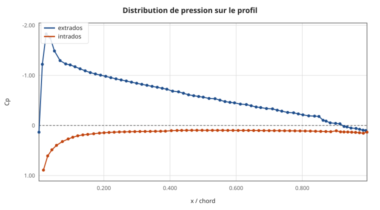

Cp axis inverted, as convention requires: the upper curve is the upper surface, in suction. The area between the two curves is the lift.


**Pressure field.** The red under the leading edge is the stagnation point, where the flow comes to rest (Cp = +1). The blue above is the suction that lifts the profile.

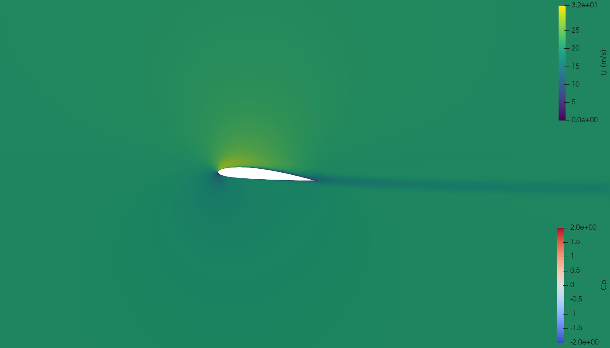

**Velocity magnitude.** The wake can be read behind the trailing edge; the thinner it is, the less the profile drags.


**Streamlines**, coloured by velocity. The acceleration over the upper surface is the counterpart of the suction: this is Bernoulli's theorem, where accelerating fluid sees its pressure drop.

### Solver convergence

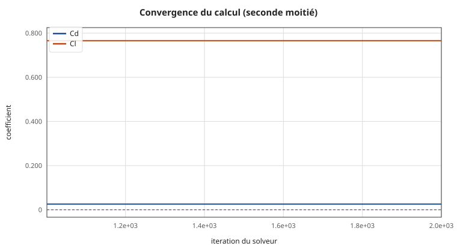

Flat curves towards the end are the condition for the coefficients to mean anything.

## What these numbers are worth

The `kOmegaSST` turbulence model assumes a turbulent boundary layer from the leading edge. At Re ≈ 4 × 10⁵ a good part of the upper surface is still laminar: **drag is overestimated**, by a factor that can approach 2. These values rank shapes against each other correctly — which is what an optimisation requires — but do not constitute a prediction of absolute drag. For a publishable figure you need a model with laminar-turbulent transition, or a wind tunnel.

## Folder contents

| file | what |
|---|---|
| `geometry.stl` | the geometry, **in metres**, as simulated |
| `profile_section.csv` | 2D section in millimetres |
| `profile_section.dat` | same section in airfoil format (XFOIL, XFLR5) |
| `design_params.yaml` | the exact parameters, replayable |
| `results.json` | the coefficients |
| `report.html` | this report, self-contained, for a browser |
| `figures/` | curves and images |
| `cfd/` | OpenFOAM case: mesh and final fields |
| `logs/` | logs of each step |

### No STEP file

This geometry was produced by the internal computer, which writes an STL directly. It can now also write a STEP, but only when the optional CAD kernel is installed (`pip install -r requirements-cad.txt`) — that capability came with v1.5 and did not exist when this run was made. Two other ways to obtain one:

1. **From Fusion 360** — copy `design_params.yaml` into `configs/`, open the model, run `fusion/parametric_driver.py` (*Utilities → ADD-INS → Scripts and Add-Ins*). The driver rebuilds exactly this shape and exports STEP **and** STL.
2. **Starting from the section** — import `profile_section.csv` as a point cloud into CAD, fit a spline through it, extrude over the span. This is the route to prefer for design work: you get clean, parameterisable geometry, where converting an STL would only give a faceted solid of several hundred faces.

## Opening the files

```bash
# the geometry (STL in metres)
paraview geometry.stl

# the CFD fields
paraview cfd/best_design.foam

# regenerate the visuals after a change
xvfb-run -a pvbatch paraview_render.py cfd figures 20 1.225

# resume the optimisation from this design
cp design_params.yaml configs/design_params.yaml
python3 scripts/run_loop.py --max-iterations 20 \
    --cfd-settings configs/cfd_settings_fast.yaml
```

In ParaView, the final time step carries `U` (velocity), `p` (**kinematic** pressure, in m²/s² — multiply by ρ = 1.225 kg/m³ for pascals), `k`, `omega` and `nut`. The `wing` patch is the wing surface.

---

Exported on 20/08/2026 at 13:45 UTC by `scripts/export_best.py`.
