# Design optimisé — `CLARK_Y_AIRFOIL`

Meilleure des **25 itérations** de la série `iterations_clarky` (25 réussies, 0 échouée), retenue sur l'objectif `maximize_Cl_Cd`.

## Performances

| | Cd | Cl | Cl/Cd |
|---|---|---|---|
| Départ (itération 0) | 0.02725 | 0.76590 | 28.11 |
| **Optimisé (itération 24)** | **0.02653** | **0.77841** | **29.34** |

**Gain de finesse : +4.4 %**

Maillage : 81594 cellules, non-orthogonalité 74.4, skewness 4.52. Coefficients moyennés sur 120 itérations, écart-type relatif 1.2e-04 sur Cd — stabilisés.

## Paramètres : départ → arrivée

| paramètre | départ | arrivée | écart | bornes |
|---|---|---|---|---|
| `cst_upper_0` | 0.129395 | **0.129395** unitless | inchangé | 0.0804316 … 0.178358 |
| `cst_upper_1` | 0.458745 | **0.454158** unitless | -1.0 % | 0.324895 … 0.592596 |
| `cst_upper_2` | -0.412568 | **-0.412568** unitless | inchangé | -0.55456 … -0.270577 |
| `cst_upper_3` | 1.67908 | **1.67908** unitless | inchangé | 1.52856 … 1.82959 |
| `cst_upper_4` | -2.16544 | **-2.20571** unitless | -1.9 % | -2.3257 … -2.00519 |
| `cst_upper_5` | 3.26636 | **3.26636** unitless | inchangé | 3.0945 … 3.43821 |
| `cst_upper_6` | -2.67847 | **-2.67847** unitless | inchangé | -2.86468 … -2.49226 |
| `cst_upper_7` | 2.43253 | **2.43253** unitless | inchangé | 2.22782 … 2.63725 |
| `cst_upper_8` | -1.01333 | **-1.01333** unitless | inchangé | -1.24332 … -0.783351 |
| `cst_upper_9` | 0.781425 | **0.781425** unitless | inchangé | 0.513899 … 1.04895 |
| `cst_upper_10` | 0.0775655 | **0.0775655** unitless | inchangé | -0.25476 … 0.409891 |
| `cst_upper_11` | 0.273441 | **0.270706** unitless | -1.0 % | 0.0777792 … 0.469102 |
| `cst_lower_0` | -0.17699 | **-0.17699** unitless | inchangé | -0.225954 … -0.128027 |
| `cst_lower_1` | 0.00131412 | **0.0280843** unitless | +0.02677 (+10 % de la plage) | -0.132537 … 0.135165 |
| `cst_lower_2` | -0.283066 | **-0.283066** unitless | inchangé | -0.425057 … -0.141074 |
| `cst_lower_3` | 0.275626 | **0.275626** unitless | inchangé | 0.12511 … 0.426143 |
| `cst_lower_4` | -0.540046 | **-0.540046** unitless | inchangé | -0.700301 … -0.379791 |
| `cst_lower_5` | 0.51587 | **0.51587** unitless | inchangé | 0.34402 … 0.687721 |
| `cst_lower_6` | -0.59732 | **-0.537588** unitless | +10.0 % | -0.783533 … -0.411108 |
| `cst_lower_7` | 0.37281 | **0.369082** unitless | -1.0 % | 0.168098 … 0.577522 |
| `cst_lower_8` | -0.291223 | **-0.291223** unitless | inchangé | -0.521205 … -0.0612405 |
| `cst_lower_9` | 0.0696012 | **0.123106** unitless | +76.9 % | -0.197925 … 0.337127 |
| `cst_lower_10` | -0.0745027 | **-0.0745027** unitless | inchangé | -0.406828 … 0.257822 |
| `cst_lower_11` | -0.0298241 | **-0.0298241** unitless | inchangé | -0.225486 … 0.165837 |
| `chord` | 300 | **300** mm | inchangé | 210 … 420 |
| `span` | 80 | **80** mm | inchangé | 79.2 … 80.8 |
| `aoa` | 3 | **3** deg | inchangé | -2 … 12 |

## Avant / après

Le seed de départ face au design retenu, tous deux mesurés **dans le même régime CFD** (même régime) — comparer un maillage fin à un maillage d'exploration gonflerait le gain sans qu'il soit réel.

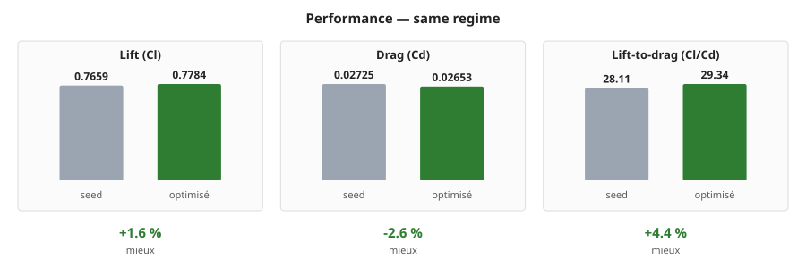

| | seed | optimisé | écart |
|---|---|---|---|
| **Portance Cl** | 0.7659 | **0.7784** | +1.6 % ✓ |
| **Traînée Cd** | 0.02725 | **0.02653** | -2.6 % ✓ |
| **Finesse Cl/Cd** | 28.11 | **29.34** | +4.4 % ✓ |

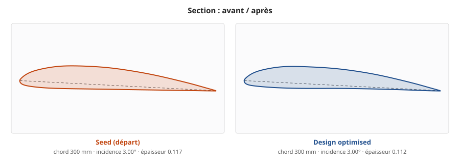

Les deux sections sont dessinées à la **même échelle** : mises chacune à la taille de son cadre, elles paraîtraient identiques et l'écart de corde comme l'incidence passeraient inaperçus.

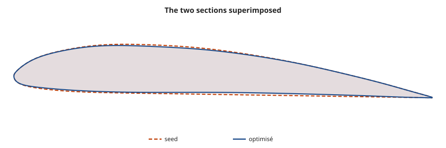

### La pression, avant et après

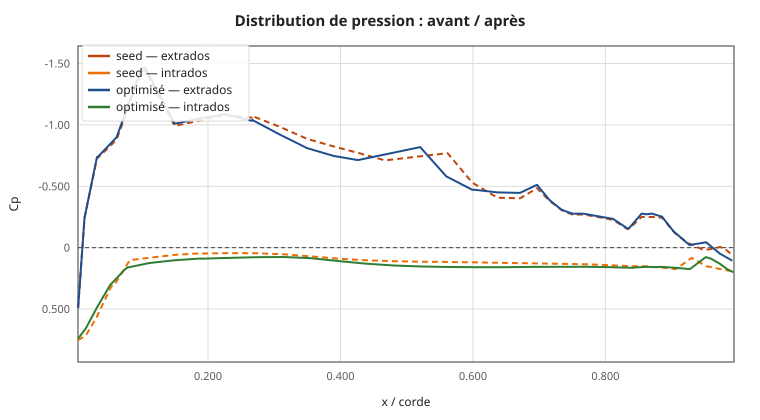

L'aire comprise entre la courbe d'extrados et celle d'intrados *est* la portance. Le design optimisé creuse davantage sa dépression d'extrados et l'étale sur la corde : c'est là que se gagne le supplément de portance.

### Les champs, côte à côte

<!-- side-by-side -->
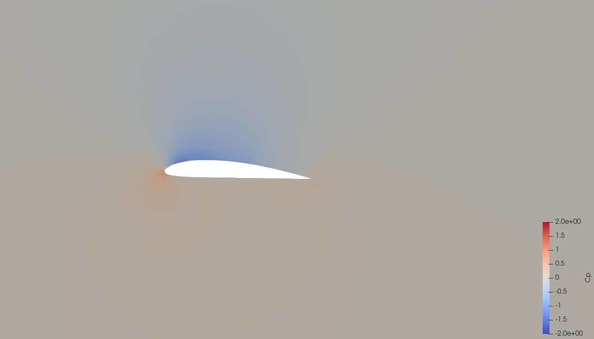
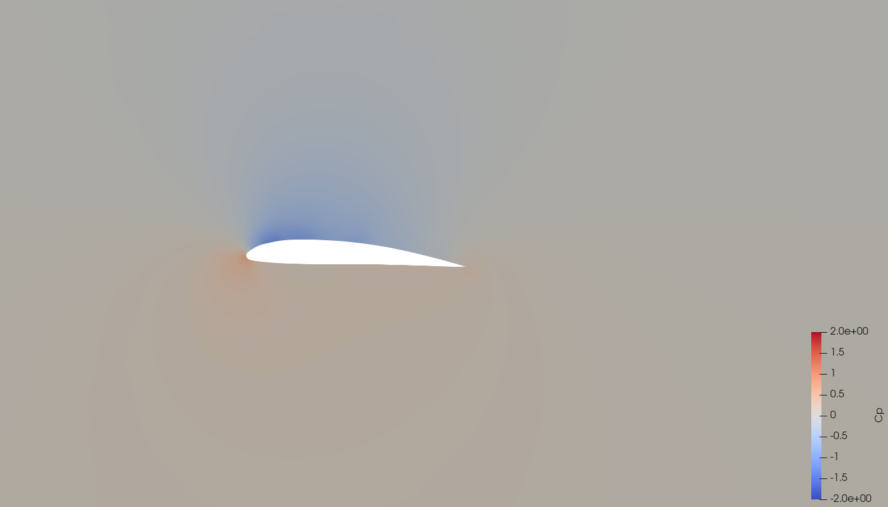
<!-- /side-by-side -->

<!-- side-by-side -->
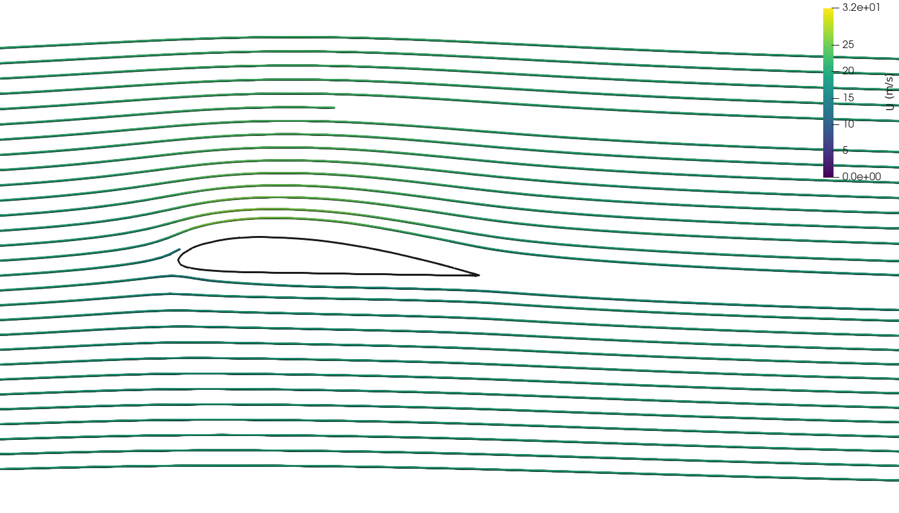
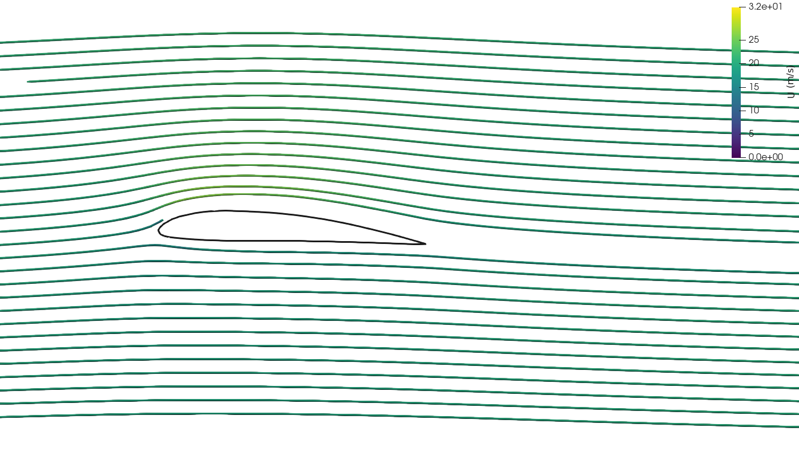
<!-- /side-by-side -->

Même échelle de couleurs des deux côtés — c'est la condition pour que la comparaison veuille dire quelque chose. La dépression d'extrados, en bleu, est nettement plus marquée et plus étendue après optimisation.

## Pourquoi cette forme est meilleure

- **Cambrure accentuée** (0.0344 → 0.0351). La cambrure décale toute la courbe de portance : un profil cambré porte déjà à incidence nulle. Elle se paie en traînée de forme et en moment de tangage, d'où l'existence d'un optimum plutôt qu'une croissance sans fin.
- **Profil aminci** (0.1171 → 0.1118 d'épaisseur relative). Un profil plus fin perturbe moins l'écoulement et traîne moins. La contrepartie est structurelle — moins d'inertie, donc moins de rigidité — et un décrochage plus brutal, le bord d'attaque plus aigu supportant mal les fortes incidences.
- **Le compromis chiffré** : la portance gagne +2 % *et* la traînée baisse de 3 %. Les deux termes s'améliorent à la fois — cas favorable, qui tient ici à ce que la surface de référence suit la corde.
- **Ce que montre la distribution de pression** : le pic de dépression atteint Cp = -1.46 à 11 % de corde. C'est l'extrados qui fait le travail — la dépression y aspire le profil vers le haut, et elle pèse bien davantage que la surpression d'intrados. Un pic très creusé suivi d'une remontée brutale annoncerait un décollement ; une remontée progressive, comme ici, indique un écoulement encore attaché.

## Déroulé de l'optimisation

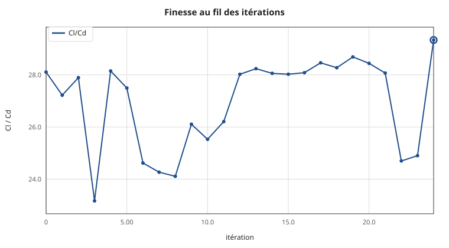

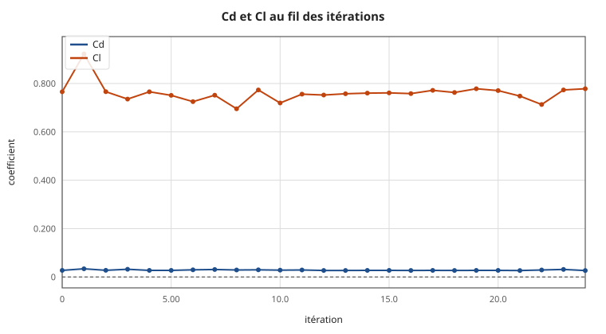

| itération | Cd | Cl | Cl/Cd | statut |
|---|---|---|---|---|
| 0 | 0.02725 | 0.76590 | 28.11 | OK |
| 1 | 0.03389 | 0.92242 | 27.22 | OK |
| 2 | 0.02747 | 0.76614 | 27.89 | OK |
| 3 | 0.03175 | 0.73545 | 23.17 | OK |
| 4 | 0.02720 | 0.76577 | 28.15 | OK |
| 5 | 0.02732 | 0.75113 | 27.49 | OK |
| 6 | 0.02946 | 0.72521 | 24.62 | OK |
| 7 | 0.03097 | 0.75162 | 24.27 | OK |
| 8 | 0.02884 | 0.69534 | 24.11 | OK |
| 9 | 0.02962 | 0.77330 | 26.11 | OK |
| 10 | 0.02818 | 0.71942 | 25.53 | OK |
| 11 | 0.02885 | 0.75603 | 26.21 | OK |
| 12 | 0.02685 | 0.75245 | 28.02 | OK |
| 13 | 0.02683 | 0.75766 | 28.24 | OK |
| 14 | 0.02710 | 0.76027 | 28.06 | OK |
| 15 | 0.02716 | 0.76116 | 28.03 | OK |
| 16 | 0.02700 | 0.75817 | 28.08 | OK |
| 17 | 0.02711 | 0.77172 | 28.46 | OK |
| 18 | 0.02699 | 0.76300 | 28.27 | OK |
| 19 | 0.02713 | 0.77821 | 28.69 | OK |
| 20 | 0.02710 | 0.77084 | 28.44 | OK |
| 21 | 0.02665 | 0.74813 | 28.07 | OK |
| 22 | 0.02888 | 0.71330 | 24.70 | OK |
| 23 | 0.03106 | 0.77341 | 24.90 | OK |
| 24 ⭐ | 0.02653 | 0.77841 | 29.34 | OK |

## L'écoulement

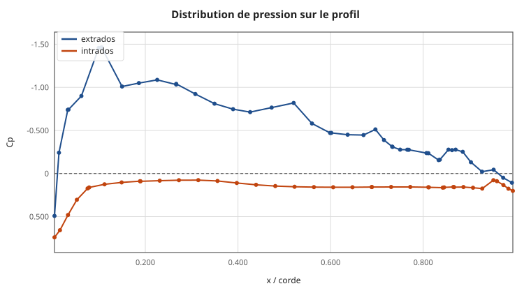

Axe des Cp inversé, comme le veut l'usage : la courbe du haut est l'extrados, en dépression. L'aire entre les deux courbes est la portance.


**Champ de pression.** Le rouge sous le bord d'attaque est le point d'arrêt, où l'écoulement s'immobilise (Cp = +1). Le bleu au dessus est la dépression qui porte le profil.

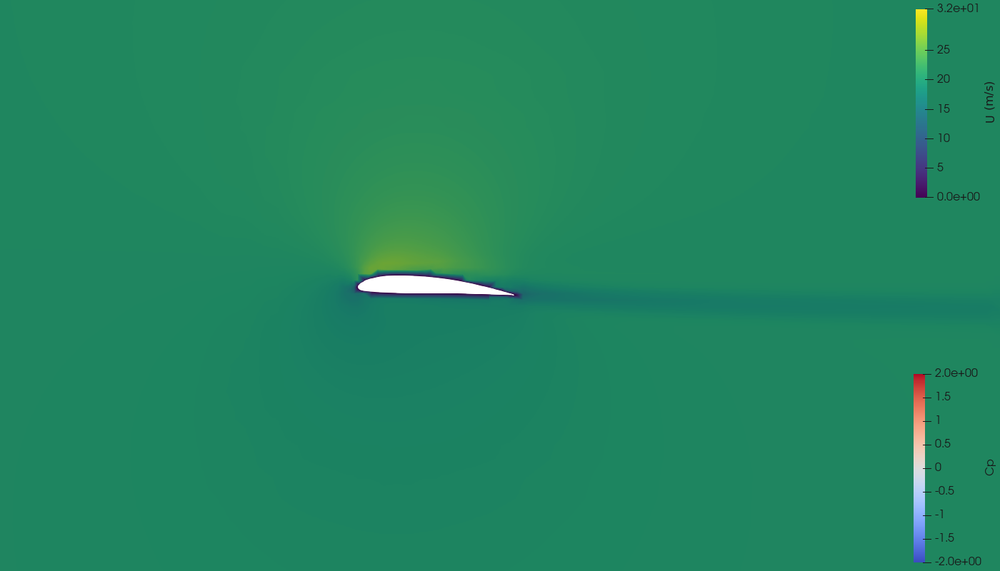

**Module de la vitesse.** Le sillage se lit derrière le bord de fuite ; plus il est mince, moins le profil traîne.


**Lignes de courant**, colorées par la vitesse. L'accélération sur l'extrados est la contrepartie de la dépression : c'est le théorème de Bernoulli, où le fluide qui accélère voit sa pression chuter.

### Convergence du calcul

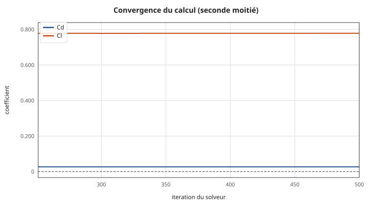

Des courbes plates sur la fin sont la condition pour que les coefficients veuillent dire quelque chose.

## Ce que valent ces chiffres

Le modèle de turbulence `kOmegaSST` suppose la couche limite turbulente dès le bord d'attaque. À Re ≈ 4 × 10⁵, une bonne part de l'extrados est encore laminaire : **la traînée est surestimée**, d'un facteur qui peut approcher 2. Ces valeurs classent correctement des formes entre elles — ce qu'exige une optimisation — mais ne constituent pas une prédiction de traînée absolue. Pour un chiffre publiable, il faut un modèle avec transition laminaire-turbulent, ou une soufflerie.

## Contenu du dossier

| fichier | quoi |
|---|---|
| `geometry.stl` | la géométrie, **en mètres**, telle que simulée |
| `geometry.step` | la même, en CAO |
| `profile_section.csv` | section 2D en millimètres |
| `profile_section.dat` | même section au format profil |
| `profile_chord.dat` | profil **redressé**, corde unitaire — pour XFOIL / XFLR5 |
| `design_params.yaml` | les paramètres exacts, rejouables |
| `results.json` | les coefficients |
| `report.html` | ce rapport, autonome, pour un navigateur |
| `FUSION_RETURN.md` | comment reprendre ce design en CAO |
| `rebuild_in_fusion.py` | script Fusion qui retrace le profil |
| `figures/` | courbes et images |
| `cfd/` | case OpenFOAM : maillage et champs finaux |
| `logs/` | journaux de chaque étape |

## Continuer ce design dans Fusion 360

Une optimisation qui ne rend qu'un STL est un cul-de-sac de conception : un solide facetté de plusieurs centaines de faces ne se laisse ni congédier proprement, ni recoter. Trois voies ramènent cette forme dans une CAO éditable, détaillées dans **`FUSION_RETURN.md`**.

| voie | ce qu'on obtient | quand la choisir |
|---|---|---|
| **1. Rejouer les paramètres** | modèle natif, historique complet | dès qu'un modèle de départ existe — c'est la seule voie réellement paramétrique |
| **2. Script `rebuild_in_fusion.py`** | esquisse + extrusion, sans intervention | sans modèle de départ ; rien à localiser ni à convertir |
| **3. Importer `profile_section.csv`** | esquisse tracée à la main | pour garder la main, ou travailler dans une autre CAO |

```bash
# voie 1 : rejouer les paramètres dans Fusion
cp design_params.yaml <projet>/configs/design_params.yaml
# puis Utilities → ADD-INS → Scripts → fusion/parametric_driver.py

# voie 2 : script autonome
# Utilities → ADD-INS → Scripts → + → rebuild_in_fusion.py → Run
```

**L'incidence est déjà dans les coordonnées** de la section exportée : c'est la géométrie réellement simulée. Si le montage aval applique lui-même une incidence, elle serait comptée deux fois.

## Ouvrir les fichiers

```bash
# la géométrie (STL en mètres)
paraview geometry.stl

# les champs CFD
paraview cfd/best_design.foam

# refaire les visuels après modification
xvfb-run -a pvbatch paraview_render.py cfd figures 20 1.225

# reprendre l'optimisation depuis ce design
cp design_params.yaml configs/design_params.yaml
python3 scripts/run_loop.py --max-iterations 20 \
    --cfd-settings configs/cfd_settings_fast.yaml
```

Dans ParaView, le pas de temps final porte `U` (vitesse), `p` (pression **cinématique**, en m²/s² — multiplier par ρ = 1,225 kg/m³ pour des pascals), `k`, `omega` et `nut`. Le patch `wing` est la surface de l'aile.

---

Exporté le 24/08/2026 à 18:19 UTC par `scripts/export_best.py`.
