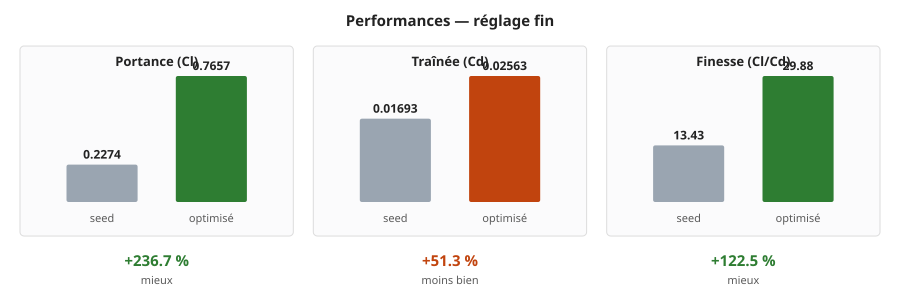
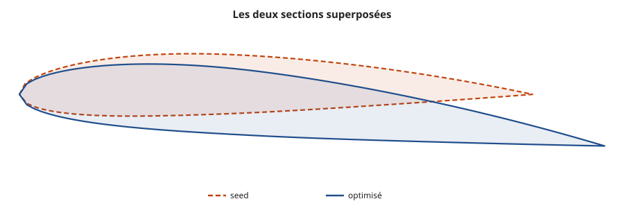
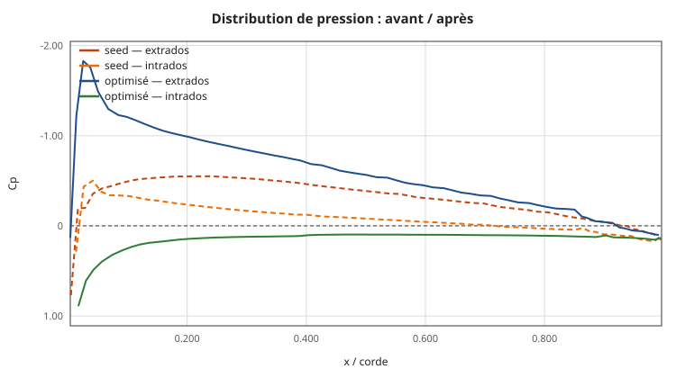
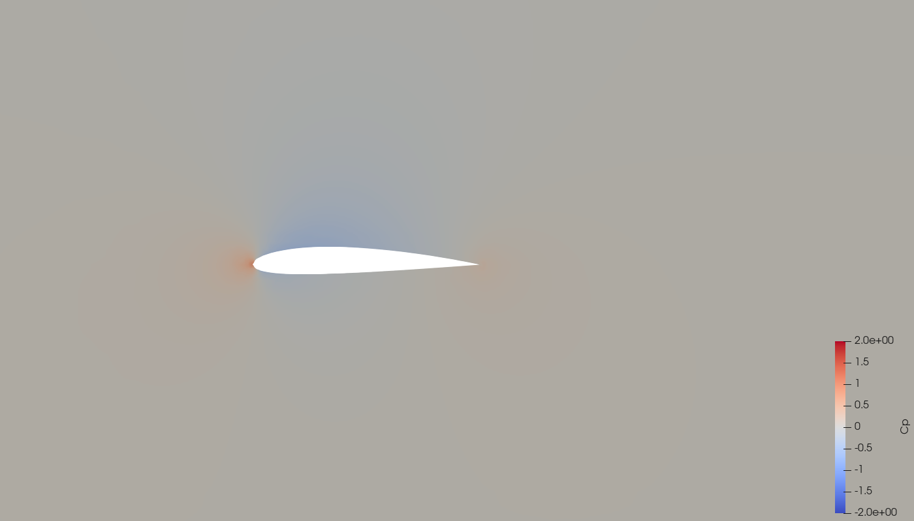
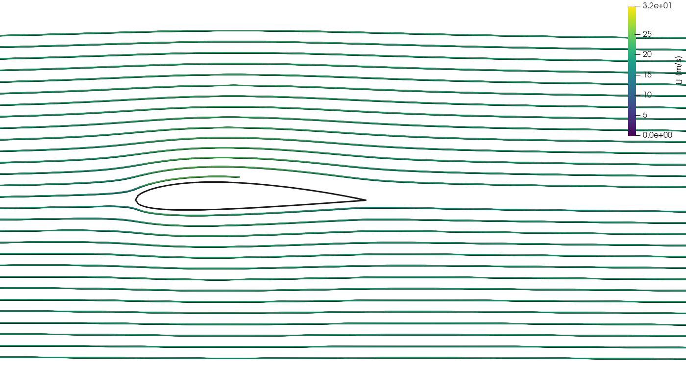
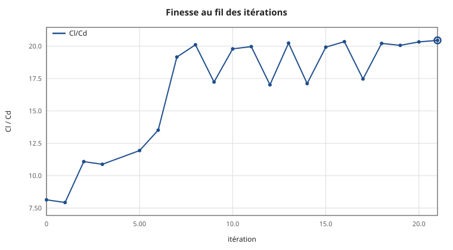
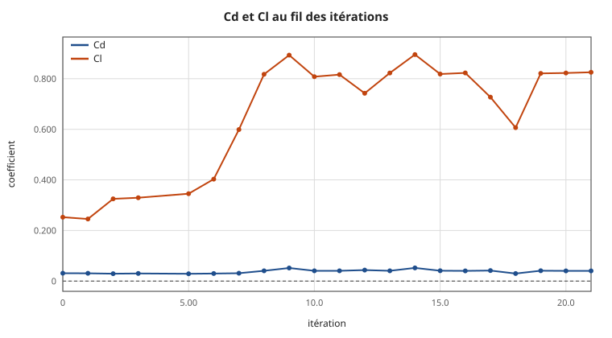
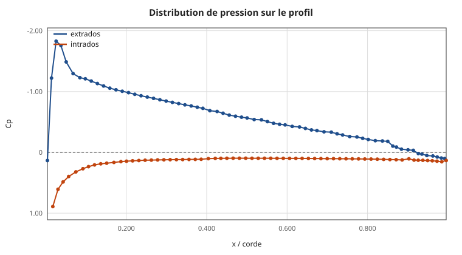
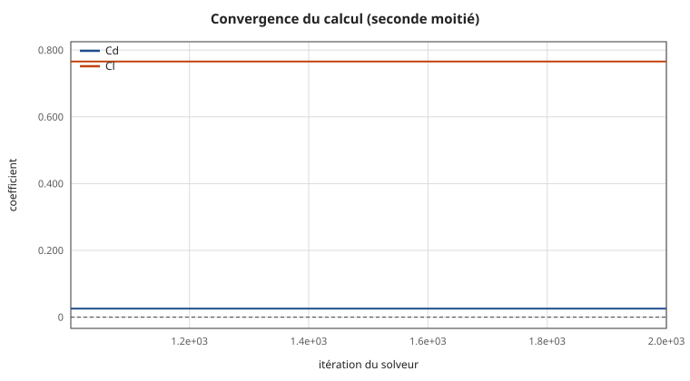

# Design optimisé — `wing_v01`

Meilleure des **22 itérations** de la série `iterations` (21 réussies, 1 échouée), retenue sur l'objectif `maximize_Cl_Cd`.

## Performances

| | Cd | Cl | Cl/Cd |
|---|---|---|---|
| Départ (itération 0) | 0.03107 | 0.25266 | 8.13 |
| **Optimisé (itération 21)** | **0.02563** | **0.76572** | **29.88** |
| *— mesuré en exploration* | *0.04037* | *0.82534* | *20.45* |

**Gain de finesse : +151.5 %**

Maillage : 168394 cellules, non-orthogonalité 47.4, skewness 2.10. Coefficients moyennés sur 200 itérations, écart-type relatif 3.7e-05 sur Cd — stabilisés.

## Paramètres : départ → arrivée

| paramètre | départ | arrivée | écart | bornes |
|---|---|---|---|---|
| `chord` | 300 | **343.47** mm | +14.5 % | 220 … 420 |
| `thickness` | 0.12 | **0.113351** unitless | -5.5 % | 0.08 … 0.2 |
| `camber` | 0.02 | **0.02** unitless | inchangé | 0 … 0.09 |
| `span` | 80 | **80** mm | inchangé | 79 … 81 |
| `aoa` | 0 | **5.04** deg | +5.04 | -2 … 12 |

## Avant / après

Le seed de départ face au design retenu, tous deux mesurés **dans le même régime CFD** (réglage fin) — comparer un maillage fin à un maillage d'exploration gonflerait le gain sans qu'il soit réel.



| | seed | optimisé | écart |
|---|---|---|---|
| **Portance Cl** | 0.2274 | **0.7657** | +236.7 % ✓ |
| **Traînée Cd** | 0.01693 | **0.02563** | +51.3 % ✗ |
| **Finesse Cl/Cd** | 13.43 | **29.88** | +122.5 % ✓ |


Les deux sections sont dessinées à la **même échelle** : mises chacune à la taille de son cadre, elles paraîtraient identiques et l'écart de corde comme l'incidence passeraient inaperçus.



### La pression, avant et après



L'aire comprise entre la courbe d'extrados et celle d'intrados *est* la portance. Le design optimisé creuse davantage sa dépression d'extrados et l'étale sur la corde : c'est là que se gagne le supplément de portance.

### Les champs, côte à côte

<!-- side-by-side -->


<!-- /side-by-side -->

<!-- side-by-side -->


<!-- /side-by-side -->

Même échelle de couleurs des deux côtés — c'est la condition pour que la comparaison veuille dire quelque chose. La dépression d'extrados, en bleu, est nettement plus marquée et plus étendue après optimisation.

## Pourquoi cette forme est meilleure

- **Incidence augmentée de 5.04°** (0.00° → 5.04°). C'est le levier le plus direct sur la portance : incliner le profil dévie davantage l'écoulement vers le bas, et la réaction de cette déviation *est* la portance. La traînée induite croît en gros comme le carré de la portance, si bien que la finesse passe par un maximum — typiquement entre 4° et 6° pour un profil cambré — puis s'effondre au décrochage. La valeur retenue, 5.04°, tombe dans cette plage : la recherche a trouvé le sommet de la courbe.
- **Profil aminci** (0.1200 → 0.1134 d'épaisseur relative). Un profil plus fin perturbe moins l'écoulement et traîne moins. La contrepartie est structurelle — moins d'inertie, donc moins de rigidité — et un décrochage plus brutal, le bord d'attaque plus aigu supportant mal les fortes incidences.
- **Corde portée à 343.5 mm** (depuis 300.0). Elle agit par deux voies : le nombre de Reynolds augmente, ce qui abaisse légèrement le coefficient de frottement, et la surface de référence change — elle est recalculée à chaque itération, sans quoi la comparaison des coefficients n'aurait aucun sens.
- **Le compromis chiffré** : la portance gagne +237 % pour seulement +51 % de traînée. C'est exactement ce que cherche une optimisation de finesse — non pas traîner moins, mais porter beaucoup plus pour un supplément de traînée modeste.
- **Ce que montre la distribution de pression** : le pic de dépression atteint Cp = -1.83 à 3 % de corde. C'est l'extrados qui fait le travail — la dépression y aspire le profil vers le haut, et elle pèse bien davantage que la surpression d'intrados. Un pic très creusé suivi d'une remontée brutale annoncerait un décollement ; une remontée progressive, comme ici, indique un écoulement encore attaché.

## Déroulé de l'optimisation





| itération | Cd | Cl | Cl/Cd | statut |
|---|---|---|---|---|
| 0 | 0.03107 | 0.25266 | 8.13 | OK |
| 1 | 0.03097 | 0.24549 | 7.93 | OK |
| 2 | 0.02934 | 0.32521 | 11.09 | OK |
| 3 | 0.03031 | 0.32959 | 10.88 | OK |
| 4 | — | — | — | échec — checkMesh : checkMesh signale 1 contrôle(s) en échec ∕ skewness 4.02823 au dessus du seuil |
| 5 | 0.02894 | 0.34550 | 11.94 | OK |
| 6 | 0.02982 | 0.40307 | 13.52 | OK |
| 7 | 0.03126 | 0.59892 | 19.16 | OK |
| 8 | 0.04066 | 0.81759 | 20.11 | OK |
| 9 | 0.05184 | 0.89319 | 17.23 | OK |
| 10 | 0.04083 | 0.80797 | 19.79 | OK |
| 11 | 0.04088 | 0.81614 | 19.96 | OK |
| 12 | 0.04364 | 0.74246 | 17.01 | OK |
| 13 | 0.04065 | 0.82237 | 20.23 | OK |
| 14 | 0.05233 | 0.89539 | 17.11 | OK |
| 15 | 0.04108 | 0.81845 | 19.92 | OK |
| 16 | 0.04044 | 0.82280 | 20.35 | OK |
| 17 | 0.04163 | 0.72703 | 17.46 | OK |
| 18 | 0.03000 | 0.60640 | 20.21 | OK |
| 19 | 0.04092 | 0.82092 | 20.06 | OK |
| 20 | 0.04047 | 0.82264 | 20.33 | OK |
| 21 ⭐ | 0.04037 | 0.82534 | 20.45 | OK |

## L'écoulement



Axe des Cp inversé, comme le veut l'usage : la courbe du haut est l'extrados, en dépression. L'aire entre les deux courbes est la portance.


**Champ de pression.** Le rouge sous le bord d'attaque est le point d'arrêt, où l'écoulement s'immobilise (Cp = +1). Le bleu au dessus est la dépression qui porte le profil.


**Module de la vitesse.** Le sillage se lit derrière le bord de fuite ; plus il est mince, moins le profil traîne.


**Lignes de courant**, colorées par la vitesse. L'accélération sur l'extrados est la contrepartie de la dépression : c'est le théorème de Bernoulli, où le fluide qui accélère voit sa pression chuter.

### Convergence du calcul



Des courbes plates sur la fin sont la condition pour que les coefficients veuillent dire quelque chose.

## Ce que valent ces chiffres

Le modèle de turbulence `kOmegaSST` suppose la couche limite turbulente dès le bord d'attaque. À Re ≈ 4 × 10⁵, une bonne part de l'extrados est encore laminaire : **la traînée est surestimée**, d'un facteur qui peut approcher 2. Ces valeurs classent correctement des formes entre elles — ce qu'exige une optimisation — mais ne constituent pas une prédiction de traînée absolue. Pour un chiffre publiable, il faut un modèle avec transition laminaire-turbulent, ou une soufflerie.

## Contenu du dossier

| fichier | quoi |
|---|---|
| `geometry.stl` | la géométrie, **en mètres**, telle que simulée |
| `profile_section.csv` | section 2D en millimètres |
| `profile_section.dat` | même section au format profil (XFOIL, XFLR5) |
| `design_params.yaml` | les paramètres exacts, rejouables |
| `results.json` | les coefficients |
| `report.html` | ce rapport, autonome, pour un navigateur |
| `figures/` | courbes et images |
| `cfd/` | case OpenFOAM : maillage et champs finaux |
| `logs/` | journaux de chaque étape |

### Pas de fichier STEP

Cette géométrie a été produite par le calculateur interne, qui écrit directement un STL : sans noyau CAO, il ne peut pas générer de STEP. Deux façons d'en obtenir un :

1. **Depuis Fusion 360** — copier `design_params.yaml` dans `configs/`, ouvrir le modèle, lancer `fusion/parametric_driver.py` (*Utilities → ADD-INS → Scripts and Add-Ins*). Le driver reconstruit exactement cette forme et exporte STEP **et** STL.
2. **En repartant de la section** — importer `profile_section.csv` comme nuage de points en CAO, y passer une spline, extruder sur l'envergure. C'est la voie à préférer pour de la conception : on récupère une géométrie propre et paramétrable, là où une conversion de STL ne donnerait qu'un solide facetté de plusieurs centaines de faces.

## Ouvrir les fichiers

```bash
# la géométrie (STL en mètres)
paraview geometry.stl

# les champs CFD
paraview cfd/best_design.foam

# refaire les visuels après modification
xvfb-run -a pvbatch paraview_render.py cfd figures 20 1.225

# reprendre l'optimisation depuis ce design
cp design_params.yaml configs/design_params.yaml
python3 scripts/run_loop.py --max-iterations 20 \
    --cfd-settings configs/cfd_settings_fast.yaml
```

Dans ParaView, le pas de temps final porte `U` (vitesse), `p` (pression **cinématique**, en m²/s² — multiplier par ρ = 1,225 kg/m³ pour des pascals), `k`, `omega` et `nut`. Le patch `wing` est la surface de l'aile.

---

Exporté le 20/08/2026 à 13:29 UTC par `scripts/export_best.py`.
