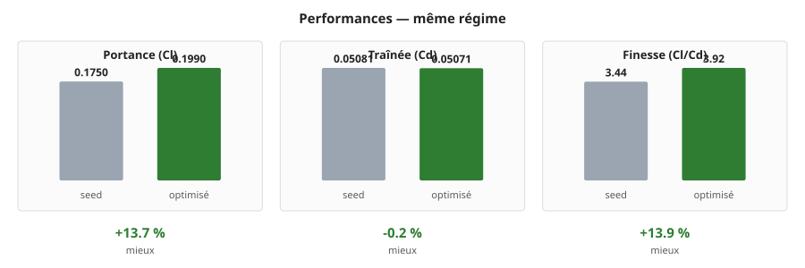
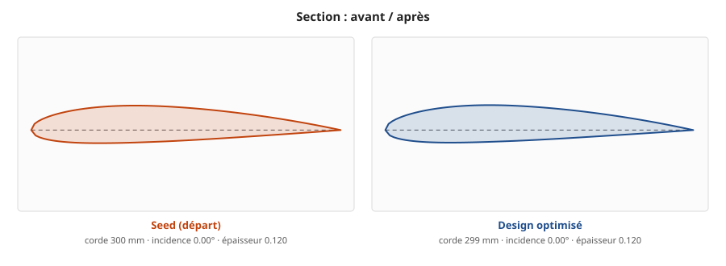
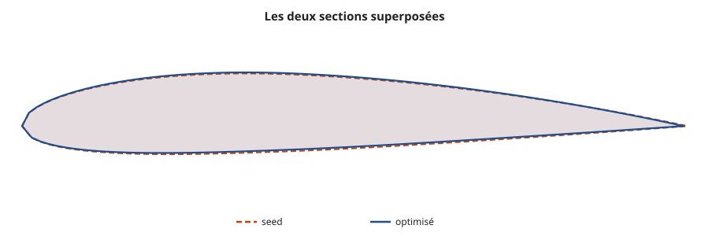
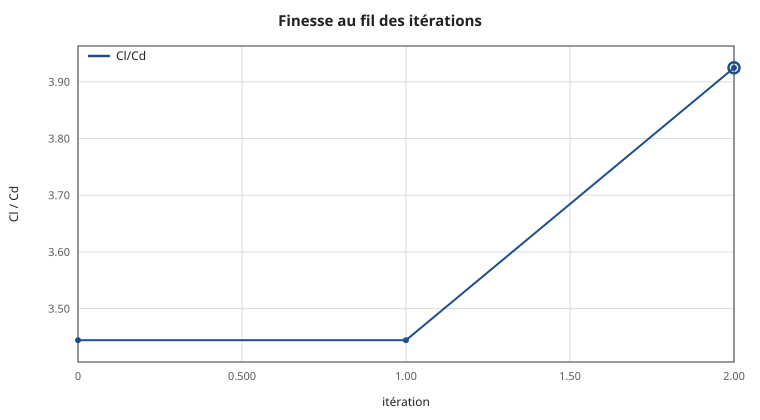
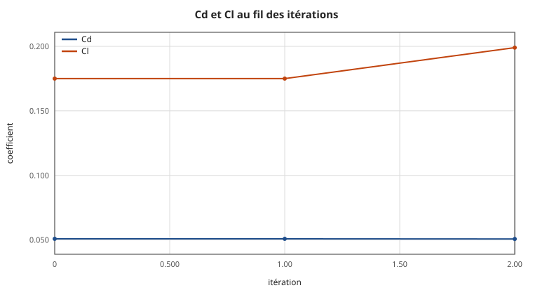

# Design optimisé — `wing_v01`

Meilleure des **3 itérations** de la série `iterations` (3 réussies, 0 échouée), retenue sur l'objectif `maximize_Cl_Cd`.

## Performances

| | Cd | Cl | Cl/Cd |
|---|---|---|---|
| Départ (itération 0) | 0.05081 | 0.17500 | 3.44 |
| **Optimisé (itération 2)** | **0.05071** | **0.19900** | **3.92** |

**Gain de finesse : +13.9 %**

Maillage : ? cellules, non-orthogonalité —, skewness —. Coefficients moyennés sur ? itérations, écart-type relatif — sur Cd — **encore instables**.

## Paramètres : départ → arrivée

| paramètre | départ | arrivée | écart | bornes |
|---|---|---|---|---|
| `chord` | 300 | **298.53** mm | -0.5 % | 220 … 420 |
| `thickness` | 0.12 | **0.12** unitless | inchangé | 0.08 … 0.2 |
| `camber` | 0.02 | **0.022** unitless | +10.0 % | 0 … 0.09 |
| `span` | 80 | **80** mm | inchangé | 79 … 81 |
| `aoa` | 0 | **0** deg | inchangé | -2 … 12 |

## Avant / après

Le seed de départ face au design retenu, tous deux mesurés **dans le même régime CFD** (même régime) — comparer un maillage fin à un maillage d'exploration gonflerait le gain sans qu'il soit réel.



| | seed | optimisé | écart |
|---|---|---|---|
| **Portance Cl** | 0.1750 | **0.1990** | +13.7 % ✓ |
| **Traînée Cd** | 0.05081 | **0.05071** | -0.2 % ✓ |
| **Finesse Cl/Cd** | 3.44 | **3.92** | +13.9 % ✓ |



Les deux sections sont dessinées à la **même échelle** : mises chacune à la taille de son cadre, elles paraîtraient identiques et l'écart de corde comme l'incidence passeraient inaperçus.



> Contours du seed non produits : champs du seed indisponibles (maillage purgé) : les contours avant / après demandent de réévaluer le seed avec `keep_case_after_run: true`

## Pourquoi cette forme est meilleure

- **Cambrure accentuée** (0.0200 → 0.0220). La cambrure décale toute la courbe de portance : un profil cambré porte déjà à incidence nulle. Elle se paie en traînée de forme et en moment de tangage, d'où l'existence d'un optimum plutôt qu'une croissance sans fin.
- **Corde portée à 298.5 mm** (depuis 300.0). Elle agit par deux voies : le nombre de Reynolds augmente, ce qui abaisse légèrement le coefficient de frottement, et la surface de référence change — elle est recalculée à chaque itération, sans quoi la comparaison des coefficients n'aurait aucun sens.
- **Le compromis chiffré** : la portance gagne +14 % *et* la traînée baisse de 0 %. Les deux termes s'améliorent à la fois — cas favorable, qui tient ici à ce que la surface de référence suit la corde.

## Déroulé de l'optimisation





| itération | Cd | Cl | Cl/Cd | statut |
|---|---|---|---|---|
| 0 | 0.05081 | 0.17500 | 3.44 | OK |
| 1 | 0.05081 | 0.17500 | 3.44 | OK |
| 2 ⭐ | 0.05071 | 0.19900 | 3.92 | OK |

## L'écoulement

> Visuels CFD non produits : case OpenFOAM absent du dossier exporté

## Ce que valent ces chiffres

Le modèle de turbulence `kOmegaSST` suppose la couche limite turbulente dès le bord d'attaque. À Re ≈ 4 × 10⁵, une bonne part de l'extrados est encore laminaire : **la traînée est surestimée**, d'un facteur qui peut approcher 2. Ces valeurs classent correctement des formes entre elles — ce qu'exige une optimisation — mais ne constituent pas une prédiction de traînée absolue. Pour un chiffre publiable, il faut un modèle avec transition laminaire-turbulent, ou une soufflerie.

## Contenu du dossier

| fichier | quoi |
|---|---|
| `geometry.stl` | la géométrie, **en mètres**, telle que simulée |
| `profile_section.csv` | section 2D en millimètres |
| `profile_section.dat` | même section au format profil (XFOIL, XFLR5) |
| `design_params.yaml` | les paramètres exacts, rejouables |
| `results.json` | les coefficients |
| `report.html` | ce rapport, autonome, pour un navigateur |
| `figures/` | courbes et images |
| `logs/` | journaux de chaque étape |

### Pas de fichier STEP

Cette géométrie a été produite par le calculateur interne, qui écrit directement un STL : sans noyau CAO, il ne peut pas générer de STEP. Deux façons d'en obtenir un :

1. **Depuis Fusion 360** — copier `design_params.yaml` dans `configs/`, ouvrir le modèle, lancer `fusion/parametric_driver.py` (*Utilities → ADD-INS → Scripts and Add-Ins*). Le driver reconstruit exactement cette forme et exporte STEP **et** STL.
2. **En repartant de la section** — importer `profile_section.csv` comme nuage de points en CAO, y passer une spline, extruder sur l'envergure. C'est la voie à préférer pour de la conception : on récupère une géométrie propre et paramétrable, là où une conversion de STL ne donnerait qu'un solide facetté de plusieurs centaines de faces.

## Ouvrir les fichiers

```bash
# la géométrie (STL en mètres)
paraview geometry.stl

# reprendre l'optimisation depuis ce design
cp design_params.yaml configs/design_params.yaml
python3 scripts/run_loop.py --max-iterations 20 \
    --cfd-settings configs/cfd_settings_fast.yaml
```

---

Exporté le 20/08/2026 à 13:30 UTC par `scripts/export_best.py`.
